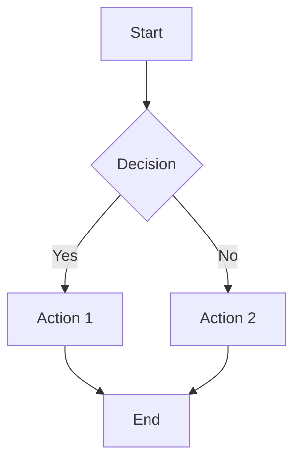

# Mermaid Diagrams

Markdown-OS provides full support for Mermaid diagrams with interactive pan/zoom controls, fullscreen viewing, and theme synchronization. Diagrams are rendered using Mermaid.js with `svg-pan-zoom` for interactivity.

## Creating Diagrams

Mermaid diagrams are created using fenced code blocks with the `mermaid` language identifier:

````markdown

````

<Info>
The editor automatically detects `language-mermaid` or `lang-mermaid` code blocks and renders them as interactive diagrams.
</Info>

## Diagram Types

Mermaid supports many diagram types:

- **Flowcharts**: `graph TD`, `graph LR`
- **Sequence Diagrams**: `sequenceDiagram`
- **Class Diagrams**: `classDiagram`
- **State Diagrams**: `stateDiagram-v2`
- **Entity Relationship**: `erDiagram`
- **Gantt Charts**: `gantt`
- **Pie Charts**: `pie`
- **Git Graphs**: `gitGraph`

## Interactive Controls

Each rendered diagram includes interactive controls:

### Inline Toolbar

<Steps>
  <Step title="Edit Button">
    Opens a modal editor to modify the diagram source code
  </Step>
  <Step title="Fullscreen Button">
    Expands the diagram to fullscreen with enhanced pan/zoom controls
  </Step>
</Steps>

### Zoom Controls

Every diagram has zoom controls in the bottom-right corner:

- **+ Button**: Zoom in
- **Reset Icon**: Reset view (fit and center)
- **− Button**: Zoom out

```javascript:wysiwyg.js:549-596
let controls = container.querySelector(".mermaid-zoom-controls");
if (!controls) {
  controls = document.createElement("div");
  controls.className = "mermaid-zoom-controls";
  
  const zoomIn = document.createElement("button");
  zoomIn.addEventListener("click", () => {
    container._panZoomInstance?.zoomIn();
  });
  
  const reset = document.createElement("button");
  reset.addEventListener("click", () => {
    const pz = container._panZoomInstance;
    pz.resetZoom();
    pz.resetPan();
    pz.fit();
    pz.center();
  });
  
  const zoomOut = document.createElement("button");
  zoomOut.addEventListener("click", () => {
    container._panZoomInstance?.zoomOut();
  });
}
```

<Tip>
You can also pan diagrams by clicking and dragging, and zoom with the mouse wheel.
</Tip>

## Pan & Zoom

Diagrams use `svg-pan-zoom` library for smooth interaction:

```javascript:wysiwyg.js:665-691
function applyZoomToDiagrams() {
  state.root.querySelectorAll(".mermaid-container .mermaid-canvas svg")
    .forEach((svgElement) => {
      const instance = window.svgPanZoom(svgElement, {
        controlIconsEnabled: false,
        zoomScaleSensitivity: 0.03,
        minZoom: 0.5,
        maxZoom: 20,
        fit: true,
        center: true,
      });
      container._panZoomInstance = instance;
    });
}
```

### Pan/Zoom Features

- **Zoom Sensitivity**: 0.03 for smooth, precise zooming
- **Zoom Range**: 0.5x to 20x magnification
- **Auto-fit**: Diagrams automatically fit within the container on load
- **Auto-center**: Diagrams are centered after fitting

## Fullscreen Mode

Click the fullscreen button to view diagrams in an expanded modal:

<Steps>
  <Step title="Open Fullscreen">
    Diagram is re-rendered at full viewport size with loading spinner
  </Step>
  <Step title="Enhanced Controls">
    Fullscreen mode has wider zoom range (0.2x to 40x) and full-viewport panning
  </Step>
  <Step title="Close">
    Press Escape or click the close button to return to the editor
  </Step>
</Steps>

```javascript:wysiwyg.js:1469-1552
async function openMermaidFullscreen(mermaidSource, fallbackSvg) {
  state.fullscreenRenderToken += 1;
  const renderToken = state.fullscreenRenderToken;
  
  // Show loading spinner
  content.innerHTML = '<div class="mermaid-fullscreen-loading">...</div>';
  
  // Render diagram
  const result = await window.mermaid.render(fullscreenId, mermaidSource);
  content.innerHTML = result.svg;
  
  // Apply pan/zoom with expanded limits
  state.fullscreenPanZoom = window.svgPanZoom(svgElement, {
    minZoom: 0.2,
    maxZoom: 40,
    fit: true,
    center: true,
  });
}
```

<Note>
Fullscreen mode preserves editor scroll position and focus, restoring them when closed.
</Note>

## Theme Synchronization

Mermaid diagrams automatically adapt to the active editor theme:

```javascript:wysiwyg.js:3-10
const mermaidThemeByAppTheme = {
  light: "default",
  dark: "dark",
  dracula: "dark",
  "nord-light": "neutral",
  "nord-dark": "dark",
  lofi: "neutral",
};
```

### Theme Initialization

```javascript:wysiwyg.js:448-466
function ensureMermaidInitialized() {
  const theme = currentMermaidTheme();
  if (state.mermaidInitialized && state.mermaidTheme === theme) {
    return;
  }
  
  window.mermaid.initialize({
    startOnLoad: false,
    securityLevel: "strict",
    theme,
    useMaxWidth: false,
  });
  state.mermaidInitialized = true;
  state.mermaidTheme = theme;
}
```

<Warning>
Changing the theme re-initializes Mermaid, which triggers re-rendering of all diagrams on the page.
</Warning>

## Rendering Pipeline

Diagrams go through a multi-step rendering process:

<Steps>
  <Step title="Detection">
    Code blocks with `language-mermaid` are detected during markdown parsing
  </Step>
  <Step title="Container Creation">
    Each diagram is wrapped in a `.mermaid-container` with a `.mermaid-canvas`
  </Step>
  <Step title="Mermaid Rendering">
    `mermaid.run()` processes all `.mermaid` nodes and generates SVG output
  </Step>
  <Step title="SVG Sizing">
    Custom logic fixes SVG dimensions to maintain aspect ratio within max height
  </Step>
  <Step title="Pan/Zoom Setup">
    `svg-pan-zoom` is attached to enable interactive controls
  </Step>
  <Step title="Controls Addition">
    Edit, fullscreen, and zoom control buttons are added to the container
  </Step>
</Steps>

```javascript:wysiwyg.js:692-750
async function renderMermaidDiagrams() {
  ensureMermaidInitialized();
  
  // Wrap code blocks in mermaid containers
  mermaidCodeBlocks.forEach((codeElement) => {
    const mermaidContainer = document.createElement("div");
    mermaidContainer.className = "mermaid-container";
    mermaidContainer.dataset.mermaidSource = sourceContent;
    preElement.replaceWith(mermaidContainer);
  });
  
  // Render all diagrams
  await window.mermaid.run({ nodes: mermaidNodes });
  
  // Fix dimensions and add interactivity
  fixMermaidSvgDimensions();
  applyZoomToDiagrams();
  
  // Add controls
  state.root.querySelectorAll(".mermaid-container").forEach((container) => {
    addMermaidControls(container);
  });
}
```

## SVG Dimension Handling

Diagrams are sized intelligently to fit within constraints:

```javascript:wysiwyg.js:611-663
function fixMermaidSvgDimensions() {
  state.root.querySelectorAll(".mermaid-container .mermaid-canvas svg")
    .forEach((svg) => {
      const bbox = svg.getBBox();
      const containerWidth = canvas.clientWidth;
      const maxHeightPx = parseMermaidMaxHeight(maxHeightValue);
      const naturalHeight = containerWidth * (bbox.height / bbox.width);
      
      if (naturalHeight <= availableHeight) {
        // Fits naturally
        svg.style.width = "100%";
        svg.style.height = `${Math.ceil(naturalHeight)}px`;
      } else {
        // Scale down to fit height
        const scale = availableHeight / naturalHeight;
        const fitWidth = Math.ceil(containerWidth * scale);
        svg.style.width = `${fitWidth}px`;
        svg.style.height = `${availableHeight}px`;
        svg.style.marginLeft = "auto";
        svg.style.marginRight = "auto";
      }
    });
}
```

<Info>
The max height is configurable via CSS custom property `--mermaid-max-height` (default: 420px).
</Info>

## Error Handling

Invalid Mermaid syntax is handled gracefully:

```javascript:wysiwyg.js:492-504
function renderMermaidError(container, source) {
  if (container._panZoomInstance) {
    container._panZoomInstance.destroy();
    container._panZoomInstance = null;
  }
  
  const errorBlock = document.createElement("div");
  errorBlock.className = "mermaid-error";
  errorBlock.textContent = `Invalid mermaid syntax:\n${source}`;
  canvas.replaceChildren(errorBlock);
  addMermaidControls(container);
}
```

<Tip>
Error messages display the invalid source code, making it easy to debug syntax issues.
</Tip>

## Editing Diagrams

Click the edit button to modify a diagram:

<Accordion title="Edit Modal">
  The block editor modal opens with:
  - Title: "Edit Mermaid diagram"
  - Textarea pre-filled with current source
  - Save and Cancel buttons
  - Keyboard shortcuts (Enter to save, Escape to cancel)
</Accordion>

<Accordion title="Re-rendering">
  After saving:
  1. Source is stored in `data-mermaid-source` attribute
  2. Canvas is cleared and new mermaid node is created
  3. `renderMermaidDiagrams()` is called to re-render
  4. Controls are re-attached
  5. Change event is emitted for auto-save
</Accordion>

```javascript:wysiwyg.js:1394-1403
if (state.blockEditType === "mermaid") {
  state.blockEditTarget.dataset.mermaidSource = source;
  const canvas = ensureMermaidCanvas(state.blockEditTarget);
  canvas.replaceChildren(createMermaidSourceNode(source));
  addMermaidControls(state.blockEditTarget);
  await renderMermaidDiagrams();
  closeBlockEditor();
  emitChange();
}
```

## Best Practices

<Note>
**Keep diagrams focused**: Large complex diagrams can be difficult to read. Consider splitting them into multiple smaller diagrams.
</Note>

<Tip>
**Test in fullscreen**: Use fullscreen mode to verify your diagram looks good at different sizes before saving.
</Tip>

<Warning>
**Syntax validation**: Mermaid syntax errors prevent rendering. Use the [Mermaid Live Editor](https://mermaid.live/) to validate complex diagrams.
</Warning>