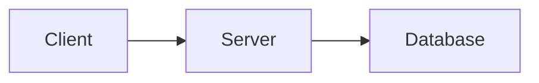

## WYSIWYG Editor

Markdown-OS uses a custom WYSIWYG (What You See Is What You Get) editor built on `contenteditable` with real-time markdown rendering.

### How It Works

The editor uses a bidirectional content flow:

<Steps>
  <Step title="Load markdown">
    Server markdown → `marked.parse()` → rendered HTML in contenteditable div
  </Step>

  <Step title="Edit visually">
    Users edit rich text directly. Changes are captured via `input` and `keydown` events.
  </Step>

  <Step title="Save as markdown">
    contenteditable HTML → `TurndownService` → markdown string → `POST /api/save`
  </Step>
</Steps>

```javascript
// Simplified rendering pipeline
const html = marked.parse(markdownContent);
editorElement.innerHTML = html;

// Simplified serialization
const turndown = new TurndownService();
const markdown = turndown.turndown(editorElement.innerHTML);
```

<Info>
  The editor is implemented in `markdown_os/static/js/wysiwyg.js` (~2000 lines) with no build step required.
</Info>

## Inline Formatting

### Keyboard Shortcuts

Apply formatting with standard keyboard shortcuts:

| Shortcut | Action | Markdown |
|----------|--------|----------|
| `Cmd/Ctrl + B` | Bold | `**text**` |
| `Cmd/Ctrl + I` | Italic | `*text*` or `_text_` |
| `Cmd/Ctrl + K` | Link | `[text](url)` |
| `Cmd/Ctrl + E` | Inline code | `` `code` `` |
| `Cmd/Ctrl + D` | Strikethrough | `~~text~~` |

### Inline Markdown Shortcuts

The editor detects markdown patterns as you type and applies formatting automatically:

**Bold**  
```markdown
Type: This is **bold text** and it converts immediately
```

**Italic**  
```markdown
Type: This is *italic* or _italic_ and it converts
```

**Strikethrough**  
```markdown
Type: This is ~~deleted~~ text
```

**Inline Code**  
```markdown
Type: Use `const` for variables
```

**Links**  
```markdown
Type: Check [OpenAI](https://openai.com) for details
```

<Tip>
  Inline shortcuts are detected on `input` and `keydown` events. Patterns must be complete (closing delimiter entered) to trigger conversion.
</Tip>

## Toolbar

The floating toolbar (`wysiwyg-toolbar.js`) provides quick access to formatting commands.

### Inline Formatting Buttons

Buttons change state based on current selection:

```javascript
function updateInlineButtonState() {
  document.querySelectorAll(".toolbar-button[data-command]").forEach((button) => {
    const command = button.dataset.command;
    let active = false;
    
    if (command === "bold") {
      active = document.queryCommandState("bold");
    } else if (command === "italic") {
      active = document.queryCommandState("italic");
    }
    
    button.classList.toggle("active", active);
  });
}
```

Active buttons are highlighted to show current formatting.

### Heading Selector

Click the heading dropdown to convert the current paragraph:

```markdown
# Heading 1
## Heading 2
### Heading 3
```

Headings are detected and the dropdown shows the current level:

```javascript
function getCurrentHeadingLevel() {
  const selection = window.getSelection();
  let node = selection.anchorNode;
  while (node && node !== editor) {
    if (node.nodeType === Node.ELEMENT_NODE && /^H[1-6]$/.test(node.tagName)) {
      return Number(node.tagName[1]);
    }
    node = node.parentElement;
  }
  return 0;
}
```

### List Toggles

Convert paragraphs to lists:

- **Bullet List** - Unordered list with `- ` or `* ` markers
- **Ordered List** - Numbered list with `1. `, `2. `, etc.

### Insert Menu

The insert menu provides templates for complex structures:

<Tabs>
  <Tab title="Table">
    Inserts a 3×3 table template:

    ```markdown
    | Header 1 | Header 2 | Header 3 |
    |----------|----------|----------|
    | Cell 1   | Cell 2   | Cell 3   |
    | Cell 4   | Cell 5   | Cell 6   |
    ```
  </Tab>

  <Tab title="Image">
    Prompts for URL and alt text:

    ```markdown
    
    ```
  </Tab>

  <Tab title="Horizontal Rule">
    Inserts a divider:

    ```markdown
    ---
    ```
  </Tab>

  <Tab title="Mermaid Diagram">
    Inserts a Mermaid code block template:

    ````markdown
    ```mermaid
    graph TD
      A[Start] --> B[End]
    ```
    ````
  </Tab>
</Tabs>

## Block Editing

### Code Blocks

Code blocks are **click-to-edit**. The rendered code block shows a modal when clicked:

```javascript
// Block content is stored in data-original-content attribute
const originalContent = codeBlock.dataset.originalContent;

// Modal shows textarea with raw markdown
const updatedContent = await MarkdownOS.prompt("Edit code:", originalContent);

// Update the data attribute and re-render
codeBlock.dataset.originalContent = updatedContent;
```

**Features:**
- Syntax highlighting via `highlight.js`
- Language labels (e.g., `python`, `javascript`)
- Copy button with success feedback
- Line numbers for long blocks

<Note>
  Code blocks preserve exact indentation and whitespace. The raw content is stored separately from the rendered HTML.
</Note>

### Mermaid Diagrams

Mermaid blocks are also click-to-edit:

````markdown

````

Rendered diagrams support:
- **Pan and Zoom** - Interactive navigation with `svg-pan-zoom`
- **Click to Edit** - Modify the Mermaid source code
- **Error Display** - Syntax errors show in red with helpful messages

```javascript
try {
  const { svg } = await mermaid.render('mermaid-' + id, content);
  container.innerHTML = svg;
  svgPanZoom(container.querySelector('svg'), {
    controlIconsEnabled: true,
    zoomScaleSensitivity: 0.3,
  });
} catch (error) {
  container.innerHTML = `<div class="mermaid-error">${error.message}</div>`;
}
```

### Math Equations

KaTeX renders inline and display math:

**Inline Math**  
```markdown
The formula $E = mc^2$ is famous.
```

**Display Math**  
```markdown
$$
\\int_{-\\infty}^{\\infty} e^{-x^2} dx = \\sqrt{\\pi}
$$
```

Math blocks are click-to-edit like code blocks. LaTeX source is stored in `data-original-content`.

## Auto-save

The editor auto-saves after 1 second of inactivity:

```javascript
const SAVE_DEBOUNCE_MS = 1000;

let saveTimeout = null;
editor.addEventListener('input', () => {
  clearTimeout(saveTimeout);
  saveTimeout = setTimeout(() => {
    saveContent();
  }, SAVE_DEBOUNCE_MS);
});
```

### Save Status Indicator

The save status indicator shows:
- **Saving...** - Request in progress
- **Saved** - Last save succeeded (shows timestamp)
- **Error** - Save failed (shows error message)

```javascript
function updateSaveStatus(status, message) {
  const indicator = document.getElementById('save-status');
  indicator.textContent = message;
  indicator.className = `save-status-${status}`;
}
```

<Tip>
  You can manually save with `Cmd/Ctrl + S`, but auto-save handles it automatically in most cases.
</Tip>

## Conflict Detection

When external changes occur while you have unsaved edits, a conflict modal appears:

```javascript
if (hasUnsavedChanges && externalContentDifferent) {
  const choice = await MarkdownOS.confirmWithOptions(
    "File changed externally",
    ["Save My Changes", "Discard My Changes", "Cancel"]
  );
  
  if (choice === 0) {
    await saveContent(); // Overwrite external changes
  } else if (choice === 1) {
    loadContent(); // Discard local changes
  }
}
```

**Options:**
1. **Save My Changes** - Your edits win, overwriting external changes
2. **Discard My Changes** - External changes win, your edits are lost
3. **Cancel** - Keep editing, resolve manually later

## Undo/Redo

The editor maintains an undo stack:

```javascript
const MAX_HISTORY = 100;

class UndoStack {
  constructor() {
    this.history = [];
    this.currentIndex = -1;
  }
  
  push(state) {
    this.history = this.history.slice(0, this.currentIndex + 1);
    this.history.push(state);
    if (this.history.length > MAX_HISTORY) {
      this.history.shift();
    }
    this.currentIndex = this.history.length - 1;
  }
  
  undo() {
    if (this.currentIndex > 0) {
      this.currentIndex--;
      return this.history[this.currentIndex];
    }
  }
  
  redo() {
    if (this.currentIndex < this.history.length - 1) {
      this.currentIndex++;
      return this.history[this.currentIndex];
    }
  }
}
```

**Shortcuts:**
- `Cmd/Ctrl + Z` - Undo
- `Cmd/Ctrl + Shift + Z` - Redo
- Toolbar buttons also trigger undo/redo

<Warning>
  History is stored in memory only. Refreshing the page clears the undo stack.
</Warning>

## Links

Links have special handling:

**Click to Edit**  
Regular click opens an edit dialog:

```javascript
link.addEventListener('click', (e) => {
  if (!e.metaKey && !e.ctrlKey) {
    e.preventDefault();
    const newUrl = await MarkdownOS.prompt("Edit URL:", link.href);
    if (newUrl) {
      link.href = newUrl;
    }
  }
});
```

**Cmd/Ctrl+Click to Open**  
Holding Cmd (Mac) or Ctrl (Windows/Linux) opens the link in a new tab:

```javascript
if (e.metaKey || e.ctrlKey) {
  window.open(link.href, '_blank');
}
```

## Image Upload

Images can be added by:
- **Dragging and dropping** onto the editor
- **Pasting** from clipboard (`Cmd/Ctrl + V`)
- **Insert menu** toolbar button (prompts for URL)

See the [Images guide](/guides/images) for detailed upload documentation.

## Table of Contents

The TOC sidebar (`toc.js`) auto-generates navigation from headings:

```javascript
function buildTOC() {
  const headings = editor.querySelectorAll('h1, h2, h3, h4, h5, h6');
  const toc = [];
  
  headings.forEach((heading, index) => {
    const level = parseInt(heading.tagName[1]);
    const text = heading.textContent;
    const id = `heading-${index}`;
    heading.id = id;
    
    toc.push({ level, text, id });
  });
  
  renderTOC(toc);
}
```

**Features:**
- Nested indentation based on heading levels
- Smooth scrolling to sections
- Active section highlighting
- Automatically updates when headings change

## Search and Replace

The search dialog supports:
- **Case-sensitive** and **case-insensitive** modes
- **Match highlighting** in the editor
- **Replace** and **Replace All** actions
- **Keyboard navigation** (`Enter` for next, `Shift+Enter` for previous)

Access search with:
- `Cmd/Ctrl + F` - Open find dialog
- `Cmd/Ctrl + H` - Open find and replace dialog

## Accessibility

### Keyboard Navigation

All toolbar buttons and menus are keyboard accessible:

```html
<button
  class="toolbar-button"
  data-command="bold"
  aria-label="Bold (Cmd+B)"
  tabindex="0"
>
  <strong>B</strong>
</button>
```

### ARIA Labels

UI elements include descriptive ARIA labels for screen readers:

```html
<div role="navigation" aria-label="File tree">
  <button aria-expanded="false" aria-label="Expand folder">...</button>
</div>
```

### Focus Management

Dialogs trap focus and restore it after closing:

```javascript
function showDialog(content) {
  const previousFocus = document.activeElement;
  dialog.showModal();
  dialog.querySelector('input').focus();
  
  dialog.addEventListener('close', () => {
    previousFocus?.focus();
  }, { once: true });
}
```

## Performance Optimizations

### Debounced Rendering

Markdown rendering is debounced to avoid blocking on rapid input:

```javascript
const RENDER_DEBOUNCE_MS = 100;

let renderTimeout = null;
editor.addEventListener('input', () => {
  clearTimeout(renderTimeout);
  renderTimeout = setTimeout(() => {
    renderMarkdown();
  }, RENDER_DEBOUNCE_MS);
});
```

### Virtual Scrolling

Large files with hundreds of headings use virtual scrolling in the TOC to maintain smooth performance.

### Lazy Loading

Code highlighting and Mermaid rendering happen on-demand using Intersection Observer:

```javascript
const observer = new IntersectionObserver((entries) => {
  entries.forEach(entry => {
    if (entry.isIntersecting) {
      renderCodeBlock(entry.target);
      observer.unobserve(entry.target);
    }
  });
});
```