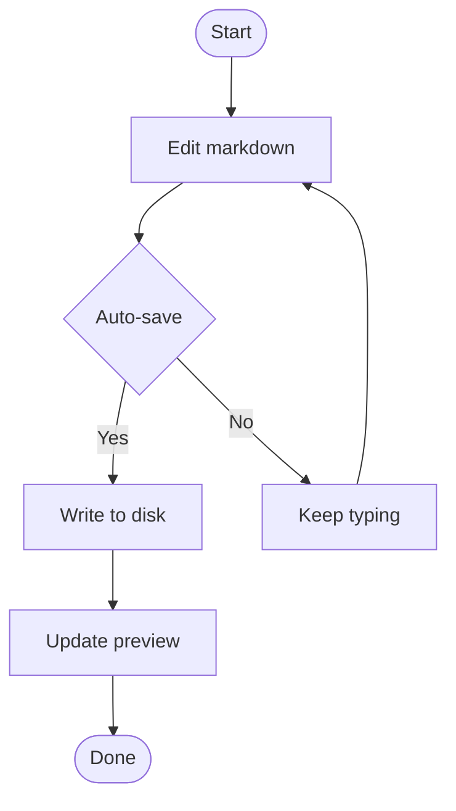

# Quick Start Guide

Get productive with Markdown-OS in under 5 minutes. This guide covers the essentials using real examples.

## Your First File

Let's start by creating and opening a markdown file:

<Steps>
  <Step title="Create a markdown file">
    Create a simple markdown file to work with:
    
    ```bash
    echo "# My First Note" > notes.md
    ```
  </Step>
  
  <Step title="Open in Markdown-OS">
    Launch the editor with a single command:
    
    ```bash
    markdown-os open notes.md
    ```
    
    Your browser opens automatically at `http://127.0.0.1:8000`
  </Step>
  
  <Step title="Start editing">
    Click in the editor and start typing. Content auto-saves after 1 second of inactivity.
  </Step>
</Steps>

<Note>
  If port 8000 is occupied, Markdown-OS automatically tries 8001, 8002, etc. Watch the console output for the actual URL.
</Note>

## Generate a Feature Showcase

The fastest way to explore Markdown-OS features is using the example command:

```bash
markdown-os example
```

This creates `example.md` in your current directory with:
- Text formatting examples
- Code blocks with syntax highlighting
- Mermaid diagrams (flowcharts, sequence diagrams, state machines)
- Math equations with KaTeX
- Tables, lists, blockquotes
- Image upload examples

### Open the Example Immediately

```bash
markdown-os example --open
```

This generates the file and launches the editor in one command.

### Custom Output Path

```bash
markdown-os example ./docs/showcase.md
```

### Overwrite Without Prompting

```bash
markdown-os example --force
```

<Note>
  Use `--force` or `-f` to skip the overwrite confirmation for existing files.
</Note>

## Single File vs Directory Mode

Markdown-OS operates in two modes based on what you open:

### Single File Mode

Open a single markdown file for focused editing:

```bash
markdown-os open ./notes.md
```

**Features:**
- Clean, distraction-free interface
- No sidebar or tabs
- Perfect for quick edits
- Ideal for personal notes

### Directory Workspace Mode

Open an entire directory to work with multiple files:

```bash
markdown-os open ./my-docs
```

**Features:**
- File tree sidebar with search
- Multi-file tabs (up to 15 open files)
- Smart tab naming for duplicate filenames
- URL-based file routing: `?file=path/to/file.md`
- Cached content and scroll positions

<Note>
  The directory must contain at least one `.md` or `.markdown` file to open in workspace mode.
</Note>

### Open Current Directory

Run `markdown-os` without arguments to open the current directory:

```bash
markdown-os
```

This is equivalent to:

```bash
markdown-os open .
```

## Essential Features

### Auto-Save

Markdown-OS automatically saves your work:

- **Debounce delay**: 1 second after you stop typing
- **Status indicator**: Shows "Saving..." → "Saved" or error states
- **Never lose work**: Even if your browser crashes, content is persisted

### Live Preview

See your rendered markdown as you type:

- **Instant updates**: Preview refreshes as you edit
- **Syntax highlighting**: Code blocks with language detection
- **Mermaid rendering**: Diagrams render inline with pan/zoom
- **KaTeX math**: LaTeX equations rendered beautifully

### Inline Markdown Shortcuts

Type markdown syntax and watch it transform:

| Type This | Get This | Feature |
| --- | --- | --- |
| `**text**` | **text** | Bold |
| `*text*` | *text* | Italic |
| `~~text~~` | ~~text~~ | Strikethrough |
| `` `code` `` | `code` | Inline code |
| `# Space` | Heading 1 | H1 heading |
| `## Space` | Heading 2 | H2 heading |
| `- Space` | • List item | Unordered list |
| `1. Space` | 1. List item | Ordered list |

### Image Upload

Add images with drag-and-drop or paste:

<Steps>
  <Step title="Copy an image">
    Copy an image to your clipboard from any app
  </Step>
  
  <Step title="Paste in editor">
    Press `Ctrl+V` (Windows/Linux) or `Cmd+V` (macOS) in the editor
  </Step>
  
  <Step title="Image saved automatically">
    The image is uploaded to an `images/` directory and markdown syntax is inserted
  </Step>
</Steps>

Supported formats: PNG, JPG, GIF, WEBP, SVG, BMP, ICO (max 10MB)

**Drag and Drop:**

Drag image files directly onto the editor to upload them.

### Mermaid Diagrams

Create diagrams with Mermaid syntax:

````markdown

````

Click the rendered diagram to edit the source. Diagrams support pan/zoom in preview mode.

### Code Blocks

Write code with syntax highlighting:

````markdown
```python
from pathlib import Path

def read_markdown(filepath: Path) -> str:
    """Read and return markdown file content."""
    return filepath.read_text(encoding="utf-8")

if __name__ == "__main__":
    content = read_markdown(Path("notes.md"))
    print(content)
```
````

**Features:**
- Automatic language detection
- Copy button on hover
- Language label badge
- Line numbers (optional)
- 180+ languages supported via highlight.js

### Math Equations

Render LaTeX equations with KaTeX:

**Inline math:**

```markdown
Einstein's equation: $E = mc^2$
```

**Display math:**

```markdown
$$
x = \frac{-b \pm \sqrt{b^2 - 4ac}}{2a}
$$
```

Click display equations in preview to copy the LaTeX source.

## Command Reference

### Open Command

```bash
markdown-os open <PATH> [OPTIONS]
```

**Arguments:**
- `PATH`: File or directory to open (required)

**Options:**
- `--host TEXT`: Host interface to bind (default: `127.0.0.1`)
- `--port INTEGER`: Preferred start port (default: `8000`)
- `--help`: Show help message

**Examples:**

```bash
# Open single file
markdown-os open notes.md

# Open directory
markdown-os open ./docs

# Custom host and port
markdown-os open notes.md --host 0.0.0.0 --port 9000

# Open with specific port
markdown-os open ./workspace --port 3000
```

### Example Command

```bash
markdown-os example [OUTPUT] [OPTIONS]
```

**Arguments:**
- `OUTPUT`: Output path for example file (default: `example.md`)

**Options:**
- `--open`: Open in editor after creation
- `--force` / `-f`: Overwrite without prompting
- `--help`: Show help message

**Examples:**

```bash
# Create example.md in current directory
markdown-os example

# Custom output path
markdown-os example ./docs/showcase.md

# Create and open immediately
markdown-os example --open

# Force overwrite
markdown-os example --force

# Combine options
markdown-os example ./test/demo.md --open --force
```

## Keyboard Shortcuts

### Editor Shortcuts

| Shortcut | Action |
| --- | --- |
| `Ctrl/Cmd + B` | Toggle bold |
| `Ctrl/Cmd + I` | Toggle italic |
| `Ctrl/Cmd + K` | Insert link |
| `Ctrl/Cmd + Z` | Undo |
| `Ctrl/Cmd + Shift + Z` | Redo |
| `Ctrl/Cmd + V` | Paste (including images) |
| `Ctrl/Cmd + Click` | Open link in new tab |
| `Tab` | Indent list item |
| `Shift + Tab` | Outdent list item |

### Browser Shortcuts

| Shortcut | Action |
| --- | --- |
| `Ctrl/Cmd + S` | Manual save (if needed) |
| `Ctrl/Cmd + R` | Reload page |
| `F12` | Open developer tools |

## Advanced Usage

### Custom Host and Port

Bind to a specific host and port:

```bash
markdown-os open notes.md --host 0.0.0.0 --port 3000
```

<Warning>
  Binding to `0.0.0.0` exposes your files to the network without authentication. Only use on trusted networks.
</Warning>

### Path Validation

Markdown-OS validates paths automatically:

**For files:**
- Must exist
- Must have `.md` or `.markdown` extension
- Expands `~` to home directory
- Resolves to absolute path

**For directories:**
- Must exist
- Must contain at least one `.md` or `.markdown` file (recursive search)
- Expands `~` and resolves to absolute path

**Examples:**

```bash
# Tilde expansion
markdown-os open ~/Documents/notes.md

# Relative paths resolved
markdown-os open ../docs

# Absolute paths work too
markdown-os open /home/user/projects/readme.md
```

### Conflict Detection

If the file changes externally while you have unsaved edits, Markdown-OS shows a conflict dialog with three options:

1. **Save My Changes**: Overwrite the external changes with your edits
2. **Discard My Changes**: Load the external changes and lose your edits
3. **Cancel**: Keep editing without resolving the conflict

<Note>
  WebSocket notifications alert you to external changes in real-time.
</Note>

### File Tree Navigation (Workspace Mode)

In directory mode, use the sidebar to navigate:

- **Click file**: Open in new tab (or switch to existing tab)
- **Search box**: Filter files by name
- **Folder icons**: Click to expand/collapse
- **Active indicator**: Highlights currently open file

### Tab Management (Workspace Mode)

- **Click tab**: Switch to that file
- **Close button**: Close tab (prompts if unsaved changes)
- **Dirty indicator**: `•` dot shows unsaved changes
- **Smart naming**: When multiple files share the same name, shows parent directory
- **Max tabs**: Limit of 15 open tabs

## Themes

Markdown-OS includes 6 built-in themes:

1. **Default Light**: Clean, professional light theme
2. **Default Dark**: Easy-on-eyes dark theme
3. **Dracula**: Popular dark theme with vibrant colors
4. **Nord Light**: Calm, arctic-inspired light palette
5. **Nord Dark**: Polar night dark theme
6. **Lofi**: Vintage, low-contrast aesthetic

Switch themes using the dropdown in the top-right corner.

## Troubleshooting

### Browser Doesn't Open Automatically

The CLI shows the URL in the console. Copy and paste it into your browser:

```text
Opening file /path/to/notes.md at http://127.0.0.1:8000
```

### Auto-Save Not Working

Check the save status indicator:
- **"Saving..."**: Save in progress
- **"Saved"**: Success
- **Error message**: Check file permissions

### Mermaid Diagrams Not Rendering

Ensure syntax is correct:

````markdown

````

Check browser console (F12) for errors.

### Math Equations Not Rendering

Verify LaTeX syntax:

```markdown
Inline: $E = mc^2$

Display:
$$
\int_0^1 x^2 \, dx = \frac{1}{3}
$$
```

Escape dollar signs in regular text: `\$10-\$20`

### Port Already in Use

Markdown-OS auto-increments the port. Watch the console output:

```text
Opening file notes.md at http://127.0.0.1:8001
```

Or specify a different starting port:

```bash
markdown-os open notes.md --port 9000
```

## Best Practices

### File Organization

For workspace mode, organize files logically:

```
docs/
├── README.md
├── getting-started/
│   ├── installation.md
│   └── quickstart.md
├── guides/
│   ├── features.md
│   └── troubleshooting.md
└── images/
    └── (uploaded images)
```

### Backup Your Work

While auto-save is reliable, use version control:

```bash
git init
git add *.md
git commit -m "Initial notes"
```

### Image Management

Images are saved to `images/` adjacent to your markdown:

- **Single file mode**: `images/` in the same directory as the file
- **Workspace mode**: `images/` in the workspace root

Filenames are sanitized with timestamps to prevent collisions:

```
screenshot.png → screenshot-20260228-143052.png
```

### Performance Tips

- **Keep files reasonable**: Very large files (>1MB) may slow the editor
- **Close unused tabs**: In workspace mode, close tabs you're not actively using
- **Limit concurrent edits**: Auto-save works best when editing one file at a time

## Next Steps

You're ready to use Markdown-OS productively! Explore more:

<CardGroup cols={2}>
  <Card title="GitHub Repository" icon="github" href="https://github.com/elena-cabrera/markdown-os">
    View source code and contribute
  </Card>
  <Card title="Report Issues" icon="flag" href="https://github.com/elena-cabrera/markdown-os/issues">
    Found a bug? Let us know
  </Card>
  <Card title="Example Template" icon="file-code">
    Run `markdown-os example --open` to explore features
  </Card>
  <Card title="Introduction" icon="book" href="/introduction">
    Review the overview and feature list
  </Card>
</CardGroup>